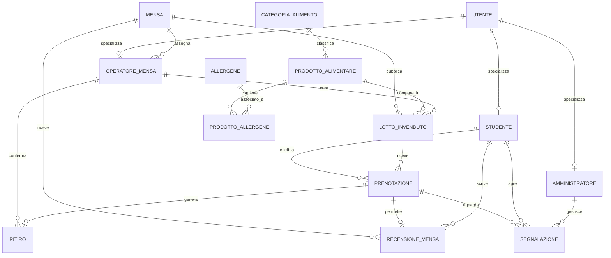

# UniFood Rescue

> Sistema informativo Django per la gestione e il recupero delle eccedenze alimentari nelle mense universitarie.


**Autore:** Andrea Dell'Anno  
**Corso:** Basi di Dati  
**Tecnologie:** Python 3.10+, Django 4.x, SQLite, Bootstrap 5  
**Tema:** recupero controllato delle eccedenze alimentari universitarie

---

## Indice

- [1. Descrizione del progetto](#1-descrizione-del-progetto)
- [2. Obiettivo del sistema](#2-obiettivo-del-sistema)
- [3. Funzionalità implementate](#3-funzionalità-implementate)
- [4. Flusso principale](#4-flusso-principale)
- [5. Analisi del dominio](#5-analisi-del-dominio)
- [6. Schema concettuale ER](#6-schema-concettuale-er)
- [7. Relazioni e cardinalità](#7-relazioni-e-cardinalità)
- [8. Generalizzazione e specializzazione](#8-generalizzazione-e-specializzazione)
- [9. Modello logico relazionale](#9-modello-logico-relazionale)
- [10. Vincoli del sistema](#10-vincoli-del-sistema)
- [11. Stati del dominio](#11-stati-del-dominio)
- [12. Scelte progettuali rilevanti](#12-scelte-progettuali-rilevanti)
- [13. Query SQL significative](#13-query-sql-significative)
- [14. Installazione e avvio](#14-installazione-e-avvio)
- [15. Credenziali di test](#15-credenziali-di-test)
- [16. Dati di esempio](#16-dati-di-esempio)
- [17. Struttura del repository](#17-struttura-del-repository)
- [18. Organizzazione delle pagine](#18-organizzazione-delle-pagine)
- [19. Requisiti implementativi coperti](#19-requisiti-implementativi-coperti)
- [20. Bonus sicurezza](#20-bonus-sicurezza)
- [21. Considerazioni finali](#21-considerazioni-finali)

---

## 1. Descrizione del progetto

**UniFood Rescue** è un'applicazione web pensata per un contesto universitario, finalizzata alla gestione e al recupero delle eccedenze alimentari prodotte dalle mense universitarie.

L'obiettivo del progetto non è realizzare una semplice piattaforma di prenotazione pasti, né una copia di applicazioni commerciali già esistenti. Il progetto è stato pensato come un vero **sistema informativo**, cioè come una piattaforma in cui i dati non vengono soltanto salvati, ma organizzati in modo coerente per rappresentare un processo reale.

Il processo reale è il seguente: a fine servizio una mensa può avere prodotti alimentari ancora disponibili. Questi prodotti non devono essere trattati come pasti generici, ma come **lotti invenduti**, cioè disponibilità concrete associate a:

- una mensa precisa;
- un prodotto alimentare preciso;
- una quantità iniziale;
- una quantità ancora disponibile;
- una data di scadenza;
- una fascia oraria di ritiro;
- uno stato operativo;
- un operatore responsabile della pubblicazione.

Gli studenti possono consultare i lotti disponibili, filtrare i risultati per mensa, categoria, caratteristiche alimentari o allergeni, prenotare una quantità e ritirarla nella fascia oraria indicata. Gli operatori mensa possono invece pubblicare nuovi lotti, aggiornare le quantità, chiudere disponibilità non più valide e confermare i ritiri. Gli amministratori supervisionano il sistema, gestiscono dati di base e prendono in carico le segnalazioni.

Il sistema non prevede pagamenti online, consegne a domicilio, QR code obbligatori o funzionalità mobile complesse. Questa scelta è voluta: il focus del progetto è la modellazione del dominio, la gestione dei dati, i vincoli di integrità e il ciclo di vita delle operazioni.

La piattaforma prevede tre tipologie principali di utenti:

- **Studenti**: consultano i lotti disponibili, prenotano prodotti, visualizzano lo storico, lasciano recensioni e aprono segnalazioni.
- **Operatori mensa**: creano lotti invenduti, modificano quantità, chiudono lotti, confermano ritiri e gestiscono i prodotti della propria mensa.
- **Amministratori**: gestiscono mense, categorie, allergeni, prodotti, statistiche e segnalazioni.

Il cuore del sistema è quindi il concetto di **recupero controllato**: un'eccedenza alimentare non è un dato isolato, ma una risorsa che viene tracciata dal momento della pubblicazione fino alla prenotazione, al ritiro o all'eventuale segnalazione.

---

## 2. Obiettivo del sistema

Il sistema nasce con l'obiettivo di supportare le mense universitarie nella gestione organizzata delle eccedenze alimentari giornaliere.

In molte mense, al termine del servizio, possono rimanere pasti o prodotti non distribuiti. Senza un sistema informativo strutturato, queste eccedenze rischiano di essere eliminate, gestite informalmente o distribuite senza una reale tracciabilità.

**UniFood Rescue** permette invece di:

- registrare le mense universitarie;
- registrare operatori associati a una specifica mensa;
- catalogare prodotti alimentari;
- classificare i prodotti per categoria;
- associare allergeni ai prodotti;
- pubblicare lotti invenduti con quantità e fascia oraria;
- consentire agli studenti di prenotare porzioni;
- aggiornare automaticamente la quantità disponibile;
- confermare i ritiri;
- produrre uno storico delle prenotazioni e dei ritiri;
- raccogliere recensioni sulle mense;
- gestire segnalazioni relative a problemi concreti;
- monitorare le quantità recuperate e lo spreco evitato.

La logica principale non è quindi quella della vendita, ma quella della **tracciabilità**. Il sistema deve rispondere a domande come:

- quale mensa ha pubblicato un certo lotto?
- quale prodotto è stato reso disponibile?
- quali allergeni contiene?
- quante porzioni erano disponibili all'inizio?
- quante sono ancora prenotabili?
- quale studente ha prenotato?
- il ritiro è stato effettivamente confermato?
- ci sono state segnalazioni o problemi?

Questa impostazione rende il progetto adatto a un esame di Basi di Dati, perché permette di mostrare progettazione concettuale, progettazione logica, vincoli di integrità, stati applicativi, storico dei dati e implementazione Django.

---

## 3. Funzionalità implementate

Le funzionalità previste e implementate nel sistema sono le seguenti:

1. Registrazione e autenticazione degli utenti con ruolo differenziato: Studente / Operatore Mensa / Amministratore.
2. Gestione delle mense universitarie.
3. Gestione del catalogo dei prodotti alimentari.
4. Gestione delle categorie alimentari.
5. Gestione degli allergeni.
6. Associazione molti-a-molti tra prodotti alimentari e allergeni.
7. Pubblicazione di lotti invenduti da parte degli operatori mensa.
8. Visualizzazione dei lotti disponibili da parte degli studenti.
9. Ricerca e filtro dei lotti per mensa, categoria, allergene, disponibilità, vegetariano e vegano.
10. Prenotazione di una quantità di un lotto da parte dello studente.
11. Aggiornamento automatico della quantità disponibile del lotto.
12. Annullamento di una prenotazione attiva con restituzione della quantità al lotto.
13. Visualizzazione dello storico delle prenotazioni dello studente.
14. Conferma del ritiro da parte dell'operatore mensa.
15. Gestione degli stati del lotto e della prenotazione.
16. Inserimento di recensioni sulla mensa dopo un ritiro completato.
17. Apertura di segnalazioni relative a prenotazioni o ritiri problematici.
18. Presa in carico e gestione delle segnalazioni da parte dell'amministratore.
19. Dashboard riepilogativa per monitorare lotti pubblicati, porzioni prenotate, porzioni ritirate e quantità recuperate.
20. Area admin Django per la gestione completa dei dati.

---

## 4. Flusso principale

Il flusso principale dell'applicazione è il seguente:

1. Un operatore mensa accede alla piattaforma.
2. L'operatore seleziona un prodotto alimentare già registrato nel sistema.
3. L'operatore crea un lotto invenduto indicando mensa, prodotto, quantità iniziale, fascia oraria di ritiro e data di scadenza.
4. Il lotto viene pubblicato nello stato `disponibile`.
5. Uno studente accede al catalogo dei lotti disponibili.
6. Lo studente filtra i lotti in base a mensa, categoria, allergeni o caratteristiche alimentari.
7. Lo studente prenota una quantità del lotto.
8. Il sistema controlla che il lotto sia disponibile, non scaduto e con quantità sufficiente.
9. Se la prenotazione è valida, il sistema riduce la quantità disponibile del lotto.
10. Lo studente si presenta in mensa nella fascia oraria prevista.
11. L'operatore mensa conferma il ritiro.
12. La prenotazione passa allo stato `ritirata`.
13. Il sistema registra un record di ritiro.
14. Lo studente può lasciare una recensione sulla mensa.
15. In caso di problema, lo studente può aprire una segnalazione.
16. L'amministratore può prendere in carico la segnalazione e chiuderla con un esito.

In forma sintetica:

```text
OperatoreMensa -> LottoInvenduto -> Prenotazione -> Ritiro -> Recensione / Segnalazione
```

Questo flusso rappresenta il ciclo di vita completo del dato: dalla pubblicazione dell'eccedenza fino alla sua consegna effettiva o alla gestione di eventuali problemi.

---

## 5. Analisi del dominio

Il dominio scelto è quello delle mense universitarie e del recupero delle eccedenze alimentari.

La parte più importante dell'analisi è distinguere tra:

- **prodotto alimentare**, cioè il tipo di alimento;
- **lotto invenduto**, cioè una disponibilità concreta di quel prodotto in una mensa, in un giorno e in una fascia oraria.

Questa distinzione evita un errore comune: trattare ogni disponibilità come se fosse un nuovo prodotto. In realtà, la pasta al pomodoro è sempre lo stesso prodotto alimentare, mentre possono esistere molti lotti diversi di pasta al pomodoro, pubblicati in giorni diversi o da mense diverse.

Esempio:

```text
ProdottoAlimentare = Pasta al pomodoro
LottoInvenduto = 8 porzioni di Pasta al pomodoro disponibili oggi alla Mensa Centrale dalle 17:00 alle 18:00
```

Da questa analisi derivano alcune entità fondamentali:

- utenti con ruoli diversi;
- mense;
- prodotti alimentari;
- categorie;
- allergeni;
- lotti invenduti;
- prenotazioni;
- ritiri;
- recensioni;
- segnalazioni.

La piattaforma non gestisce pagamenti reali. Il campo `prezzo_simbolico`, se presente, ha solo valore informativo. Questa scelta mantiene il progetto concentrato sugli aspetti informativi e non su logiche economiche, fiscali o di pagamento.

---

## 6. Schema concettuale ER

### Entità principali

#### UTENTE

Attributi principali:

- username
- password
- nome
- cognome
- email
- ruolo

Descrizione: account base della piattaforma. Rappresenta l'identità comune a tutti gli utenti del sistema.

#### STUDENTE

Attributi principali:

- matricola
- corso_studi
- anno_corso
- data_registrazione

Descrizione: specializzazione di Utente che può consultare i lotti disponibili, effettuare prenotazioni, ritirare prodotti, lasciare recensioni e aprire segnalazioni.

#### OPERATORE_MENSA

Attributi principali:

- codice_operatore
- mansione
- data_assunzione

Descrizione: specializzazione di Utente che lavora presso una mensa universitaria e può pubblicare lotti invenduti, modificare quantità, chiudere lotti e confermare ritiri.

#### AMMINISTRATORE

Attributi principali:

- area_responsabilita

Descrizione: specializzazione di Utente che gestisce gli aspetti amministrativi del sistema, come mense, categorie, prodotti, allergeni, statistiche e segnalazioni.

#### MENSA

Attributi principali:

- nome
- edificio
- indirizzo
- orario_apertura
- orario_chiusura
- attiva

Descrizione: mensa universitaria presso cui vengono pubblicati e ritirati i lotti alimentari.

#### CATEGORIA_ALIMENTO

Attributi principali:

- nome
- descrizione

Descrizione: categoria a cui appartiene un prodotto alimentare.

Esempi: Primo, Secondo, Contorno, Dolce, Bevanda, Snack.

#### PRODOTTO_ALIMENTARE

Attributi principali:

- nome
- descrizione
- vegetariano
- vegano
- attivo

Descrizione: prodotto alimentare che può essere inserito in uno o più lotti invenduti.

Esempi: Pasta al pomodoro, Riso con verdure, Pollo al forno, Insalata mista, Yogurt, Crostata.

#### ALLERGENE

Attributi principali:

- nome
- descrizione

Descrizione: allergene che può essere associato a uno o più prodotti alimentari.

Esempi: Glutine, Lattosio, Uova, Soia, Frutta a guscio, Sedano.

#### PRODOTTO_ALLERGENE

Descrizione: associazione molti-a-molti tra prodotto alimentare e allergene.

Un prodotto può contenere più allergeni. Uno stesso allergene può essere presente in più prodotti.

#### LOTTO_INVENDUTO

Attributi principali:

- quantita_iniziale
- quantita_disponibile
- data_pubblicazione
- data_scadenza
- ora_inizio_ritiro
- ora_fine_ritiro
- prezzo_simbolico
- stato
- note

Descrizione: disponibilità concreta di un certo prodotto presso una certa mensa in una certa giornata.

Questa è l'entità centrale del progetto.

#### PRENOTAZIONE

Attributi principali:

- quantita
- stato
- data_prenotazione

Descrizione: prenotazione effettuata da uno studente su un lotto disponibile.

#### RITIRO

Attributi principali:

- data_ora_ritiro
- esito
- note

Descrizione: conferma del ritiro di una prenotazione da parte di un operatore mensa.

#### RECENSIONE_MENSA

Attributi principali:

- voto
- commento
- data_inserimento

Descrizione: recensione lasciata da uno studente dopo aver completato un ritiro presso una mensa.

#### SEGNALAZIONE

Attributi principali:

- titolo
- descrizione
- stato
- esito
- data_apertura
- data_chiusura

Descrizione: segnalazione di un problema relativo a una prenotazione o a un ritiro.

Esempi:

- prodotto non disponibile al momento del ritiro;
- allergeni non indicati correttamente;
- ritiro non confermato;
- prenotazione annullata erroneamente;
- problema con la mensa.

### Diagramma ER in Mermaid



Il diagramma completo rappresenta:

- la gerarchia IS-A tra Utente, Studente, OperatoreMensa e Amministratore;
- la relazione tra OperatoreMensa e Mensa;
- la relazione tra Mensa e LottoInvenduto;
- la relazione tra OperatoreMensa e LottoInvenduto;
- la relazione tra ProdottoAlimentare e LottoInvenduto;
- la relazione tra CategoriaAlimento e ProdottoAlimentare;
- la relazione molti-a-molti tra ProdottoAlimentare e Allergene;
- la relazione tra Studente e Prenotazione;
- la relazione tra LottoInvenduto e Prenotazione;
- la relazione tra Prenotazione e Ritiro;
- la relazione tra OperatoreMensa e Ritiro;
- la relazione tra Studente e RecensioneMensa;
- la relazione tra Mensa e RecensioneMensa;
- la relazione tra Prenotazione e Segnalazione;
- la relazione tra Studente e Segnalazione;
- la relazione tra Amministratore e Segnalazione.

---

## 7. Relazioni e cardinalità

### 7.1 Utente - Studente / OperatoreMensa / Amministratore

Un utente può essere specializzato in uno e un solo ruolo operativo:

- uno studente è un utente;
- un operatore mensa è un utente;
- un amministratore è un utente.

Cardinalità:

```text
Utente 1:1 Studente
Utente 1:1 OperatoreMensa
Utente 1:1 Amministratore
```

La generalizzazione è **totale e disgiunta**.

È totale perché ogni utente registrato deve appartenere necessariamente a uno dei ruoli previsti.

È disgiunta perché un utente non può essere contemporaneamente studente, operatore mensa e amministratore.

### 7.2 Mensa - OperatoreMensa

Una mensa può avere più operatori. Ogni operatore mensa lavora presso una sola mensa.

```text
Mensa 1:N OperatoreMensa
```

Questa relazione è importante perché limita le operazioni dell'operatore alla mensa di appartenenza. Un operatore della Mensa Centrale non deve poter pubblicare o confermare ritiri per la Mensa Ingegneria.

### 7.3 CategoriaAlimento - ProdottoAlimentare

Una categoria può contenere più prodotti alimentari. Ogni prodotto alimentare appartiene a una sola categoria principale.

```text
CategoriaAlimento 1:N ProdottoAlimentare
```

### 7.4 ProdottoAlimentare - Allergene

Un prodotto alimentare può contenere più allergeni. Un allergene può essere presente in più prodotti.

```text
ProdottoAlimentare N:N Allergene
```

Associazione:

```text
ProdottoAllergene
```

Questa scelta rende il modello più estendibile: se in futuro si volesse aggiungere un nuovo allergene, non sarebbe necessario modificare la struttura della tabella `ProdottoAlimentare`.

### 7.5 Mensa - LottoInvenduto

Una mensa può pubblicare più lotti invenduti. Ogni lotto appartiene a una sola mensa.

```text
Mensa 1:N LottoInvenduto
```

### 7.6 ProdottoAlimentare - LottoInvenduto

Un prodotto alimentare può comparire in più lotti nel tempo. Ogni lotto riguarda un solo prodotto alimentare.

```text
ProdottoAlimentare 1:N LottoInvenduto
```

Questa relazione è fondamentale perché separa il concetto di prodotto generico dal concetto di disponibilità concreta.

### 7.7 OperatoreMensa - LottoInvenduto

Un operatore mensa può creare più lotti. Ogni lotto è creato da un solo operatore mensa.

```text
OperatoreMensa 1:N LottoInvenduto
```

Vincolo importante:

```text
operatore.mensa_id = lotto.mensa_id
```

### 7.8 Studente - Prenotazione

Uno studente può effettuare più prenotazioni. Ogni prenotazione è effettuata da un solo studente.

```text
Studente 1:N Prenotazione
```

### 7.9 LottoInvenduto - Prenotazione

Un lotto può ricevere più prenotazioni. Ogni prenotazione riguarda un solo lotto.

```text
LottoInvenduto 1:N Prenotazione
```

Questa relazione permette di gestire più studenti interessati allo stesso lotto, fino all'esaurimento della quantità disponibile.

### 7.10 Prenotazione - Ritiro

Una prenotazione può essere ritirata una sola volta. Ogni ritiro si riferisce a una sola prenotazione.

```text
Prenotazione 1:0..1 Ritiro
Ritiro 1:1 Prenotazione
```

La partecipazione di `Ritiro` verso `Prenotazione` è obbligatoria, perché un ritiro non può esistere senza una prenotazione.

La partecipazione di `Prenotazione` verso `Ritiro` è opzionale, perché una prenotazione può essere ancora attiva, annullata o scaduta.

### 7.11 OperatoreMensa - Ritiro

Un operatore mensa può confermare più ritiri. Ogni ritiro è confermato da un solo operatore mensa.

```text
OperatoreMensa 1:N Ritiro
```

### 7.12 Studente - RecensioneMensa

Uno studente può lasciare più recensioni. Ogni recensione è scritta da un solo studente.

```text
Studente 1:N RecensioneMensa
```

### 7.13 Mensa - RecensioneMensa

Una mensa può ricevere più recensioni. Ogni recensione riguarda una sola mensa.

```text
Mensa 1:N RecensioneMensa
```

Vincolo importante: uno studente può recensire una mensa solo dopo aver completato almeno un ritiro presso quella mensa.

### 7.14 Prenotazione - Segnalazione

Una prenotazione può essere oggetto di più segnalazioni. Ogni segnalazione riguarda una sola prenotazione.

```text
Prenotazione 1:N Segnalazione
```

### 7.15 Studente - Segnalazione

Uno studente può aprire più segnalazioni. Ogni segnalazione è aperta da un solo studente.

```text
Studente 1:N Segnalazione
```

### 7.16 Amministratore - Segnalazione

Un amministratore può gestire più segnalazioni. Una segnalazione può essere non ancora assegnata oppure gestita da un solo amministratore.

```text
Amministratore 0:N Segnalazione
Segnalazione 0:1 Amministratore
```

La relazione con l'amministratore è opzionale perché una segnalazione appena aperta potrebbe non essere ancora stata presa in carico.

---

## 8. Generalizzazione e specializzazione

Il sistema prevede una gerarchia di generalizzazione con entità padre `Utente` e tre entità figlie:

- `Studente`
- `OperatoreMensa`
- `Amministratore`

La generalizzazione è:

- **totale**, perché ogni utente registrato deve essere necessariamente uno studente, un operatore mensa o un amministratore;
- **disgiunta**, perché un utente non può appartenere contemporaneamente a più ruoli.

### Alternativa 1 — Accorpamento delle entità figlie nel padre

In questa alternativa si mantiene una sola tabella `Utente`, nella quale vengono inseriti anche gli attributi specifici di `Studente`, `OperatoreMensa` e `Amministratore`.

Schema risultante:

```text
Utente(
  id,
  username,
  password,
  nome,
  cognome,
  email,
  ruolo,
  matricola,
  corso_studi,
  anno_corso,
  data_registrazione_studente,
  codice_operatore,
  mansione,
  mensa_id,
  area_responsabilita
)
```

Vantaggi:

- una sola tabella per tutti gli utenti;
- query semplici per il recupero dei dati utente;
- nessun join necessario per ottenere il profilo completo;
- gestione centralizzata di username, email e password.

Svantaggi:

- presenza di molti valori `NULL`;
- gli attributi dello studente non hanno senso per un operatore o amministratore;
- gli attributi dell'operatore mensa non hanno senso per uno studente o amministratore;
- gli attributi dell'amministratore non hanno senso per uno studente o operatore;
- la tabella diventa molto ampia;
- maggiore difficoltà nel garantire vincoli specifici per ruolo;
- soluzione meno pulita dal punto di vista concettuale.

Vincoli necessari:

```text
ruolo IN ('studente', 'operatore_mensa', 'amministratore')
```

Se `ruolo = 'studente'`, allora:

```text
matricola IS NOT NULL
corso_studi IS NOT NULL
anno_corso IS NOT NULL
codice_operatore IS NULL
mansione IS NULL
mensa_id IS NULL
area_responsabilita IS NULL
```

Se `ruolo = 'operatore_mensa'`, allora:

```text
codice_operatore IS NOT NULL
mansione IS NOT NULL
mensa_id IS NOT NULL
matricola IS NULL
corso_studi IS NULL
anno_corso IS NULL
area_responsabilita IS NULL
```

Se `ruolo = 'amministratore'`, allora:

```text
area_responsabilita IS NOT NULL
matricola IS NULL
corso_studi IS NULL
anno_corso IS NULL
codice_operatore IS NULL
mansione IS NULL
mensa_id IS NULL
```

Giudizio: questa alternativa è semplice, ma richiede troppi controlli condizionali. Per esempio, una prenotazione deve essere effettuata solo da uno studente; se la prenotazione puntasse direttamente a `Utente`, bisognerebbe controllare ogni volta che `Utente.ruolo = 'studente'`. Lo stesso problema si avrebbe per i lotti creati dagli operatori. Per questo motivo non è stata scelta.

### Alternativa 2 — Accorpamento del padre nelle entità figlie

In questa alternativa l'entità `Utente` viene eliminata e i suoi attributi vengono duplicati nelle tabelle figlie.

Schema risultante:

```text
Studente(
  id,
  username,
  password,
  nome,
  cognome,
  email,
  matricola,
  corso_studi,
  anno_corso,
  data_registrazione
)

OperatoreMensa(
  id,
  username,
  password,
  nome,
  cognome,
  email,
  codice_operatore,
  mensa_id,
  mansione
)

Amministratore(
  id,
  username,
  password,
  nome,
  cognome,
  email,
  area_responsabilita
)
```

Vantaggi:

- ogni tabella contiene solo attributi coerenti con il proprio ruolo;
- nessun valore `NULL` dovuto alla generalizzazione;
- nessun join necessario per leggere il profilo completo;
- le relazioni possono puntare direttamente a `Studente`, `OperatoreMensa` o `Amministratore`.

Svantaggi:

- ridondanza degli attributi comuni;
- username, password, nome, cognome ed email sono ripetuti in tre tabelle;
- difficoltà nel garantire l'unicità globale di username ed email;
- per ottenere tutti gli utenti è necessario usare una `UNION`;
- soluzione meno adatta al sistema di autenticazione standard di Django.

Vincoli necessari:

- username univoco tra Studente, OperatoreMensa e Amministratore;
- email univoca tra Studente, OperatoreMensa e Amministratore.

Giudizio: questa soluzione elimina i valori nulli, ma introduce ridondanza e problemi di coerenza. Non viene scelta perché Django lavora meglio con un modello utente centralizzato e perché la duplicazione degli attributi comuni renderebbe il sistema meno pulito.

### Alternativa 3 — Mantenimento della gerarchia con tabella padre e tabelle figlie

In questa alternativa si mantiene la tabella padre `Utente` e si creano tre tabelle figlie, ciascuna collegata a `Utente` tramite chiave esterna univoca.

Schema risultante:

```text
Utente(
  id,
  username,
  password,
  nome,
  cognome,
  email,
  ruolo
)

Studente(
  id,
  utente_id [FK -> Utente, UNIQUE],
  matricola,
  corso_studi,
  anno_corso,
  data_registrazione
)

OperatoreMensa(
  id,
  utente_id [FK -> Utente, UNIQUE],
  mensa_id [FK -> Mensa],
  codice_operatore,
  mansione,
  data_assunzione
)

Amministratore(
  id,
  utente_id [FK -> Utente, UNIQUE],
  area_responsabilita
)
```

Vantaggi:

- massima normalizzazione;
- nessuna duplicazione degli attributi comuni;
- nessun valore `NULL` forzato;
- buona integrità referenziale;
- compatibilità con il sistema di autenticazione di Django;
- facilità di estensione in caso di nuovi ruoli futuri;
- gestione centralizzata di username, password ed email;
- separazione chiara tra attributi comuni e attributi specifici.

Svantaggi:

- necessità di join per recuperare il profilo completo;
- maggiore complessità nel codice applicativo;
- il vincolo di totalità deve essere garantito anche tramite logica applicativa;
- bisogna assicurare che ogni utente abbia uno e un solo profilo figlio.

### Scelta effettuata

È stata scelta la terza alternativa:

```text
Utente + Studente / OperatoreMensa / Amministratore
```

Questa scelta rappresenta il miglior compromesso tra normalizzazione, integrità dei dati e compatibilità con Django.

Inoltre consente di:

- evitare ridondanze degli attributi comuni;
- evitare molti valori `NULL`;
- mantenere separati gli attributi specifici dei ruoli;
- usare il sistema di autenticazione di Django;
- gestire in modo pulito tre ruoli differenti;
- rendere il sistema estendibile in caso di nuovi ruoli futuri.

Dal punto di vista progettuale, questa soluzione è coerente con il dominio: tutti gli utenti condividono dati di accesso e identificazione, ma hanno comportamenti applicativi diversi.

---

## 9. Modello logico relazionale

```text
Utente(
  id,
  username,
  password,
  first_name,
  last_name,
  email,
  ruolo
)

Studente(
  id,
  utente_id [FK -> Utente, UNIQUE],
  matricola,
  corso_studi,
  anno_corso,
  data_registrazione
)

OperatoreMensa(
  id,
  utente_id [FK -> Utente, UNIQUE],
  mensa_id [FK -> Mensa],
  codice_operatore,
  mansione,
  data_assunzione
)

Amministratore(
  id,
  utente_id [FK -> Utente, UNIQUE],
  area_responsabilita
)

Mensa(
  id,
  nome,
  edificio,
  indirizzo,
  orario_apertura,
  orario_chiusura,
  attiva
)

CategoriaAlimento(
  id,
  nome,
  descrizione
)

ProdottoAlimentare(
  id,
  categoria_id [FK -> CategoriaAlimento],
  nome,
  descrizione,
  vegetariano,
  vegano,
  attivo
)

Allergene(
  id,
  nome,
  descrizione
)

ProdottoAllergene(
  prodotto_id [FK -> ProdottoAlimentare],
  allergene_id [FK -> Allergene]
)

LottoInvenduto(
  id,
  mensa_id [FK -> Mensa],
  prodotto_id [FK -> ProdottoAlimentare],
  operatore_id [FK -> OperatoreMensa],
  quantita_iniziale,
  quantita_disponibile,
  data_pubblicazione,
  data_scadenza,
  ora_inizio_ritiro,
  ora_fine_ritiro,
  prezzo_simbolico,
  stato,
  note
)

Prenotazione(
  id,
  studente_id [FK -> Studente],
  lotto_id [FK -> LottoInvenduto],
  quantita,
  stato,
  data_prenotazione
)

Ritiro(
  id,
  prenotazione_id [FK -> Prenotazione, UNIQUE],
  operatore_id [FK -> OperatoreMensa],
  data_ora_ritiro,
  esito,
  note
)

RecensioneMensa(
  id,
  studente_id [FK -> Studente],
  mensa_id [FK -> Mensa],
  prenotazione_id [FK -> Prenotazione, UNIQUE],
  voto,
  commento,
  data_inserimento
)

Segnalazione(
  id,
  prenotazione_id [FK -> Prenotazione],
  autore_id [FK -> Studente],
  amministratore_id [FK -> Amministratore, NULL],
  titolo,
  descrizione,
  stato,
  esito,
  data_apertura,
  data_chiusura
)
```

Nota: in Django la relazione molti-a-molti tra `ProdottoAlimentare` e `Allergene` è implementata tramite modello esplicito `ProdottoAllergene`, con vincolo di unicità sulla coppia prodotto-allergene.

---

## 10. Vincoli del sistema

### 10.1 Vincoli sulla generalizzazione

- Ogni `Utente` deve essere associato a uno e un solo profilo tra `Studente`, `OperatoreMensa` e `Amministratore`.
- `Studente.utente_id` deve essere univoco.
- `OperatoreMensa.utente_id` deve essere univoco.
- `Amministratore.utente_id` deve essere univoco.
- Il campo `Utente.ruolo` può assumere solo i valori:
  - `studente`
  - `operatore_mensa`
  - `amministratore`

### 10.2 Vincoli su Mensa e OperatoreMensa

- Ogni `OperatoreMensa` deve essere associato a una `Mensa`.
- Una `Mensa` può avere più operatori.
- Un operatore può creare lotti solo per la mensa a cui è associato.
- Una mensa inattiva non può pubblicare nuovi lotti disponibili.
- L'orario di chiusura deve essere successivo all'orario di apertura.

### 10.3 Vincoli su prodotti, categorie e allergeni

- Ogni `ProdottoAlimentare` deve appartenere a una categoria.
- Una categoria può contenere molti prodotti.
- Un prodotto può avere zero, uno o più allergeni.
- Lo stesso allergene può essere associato a molti prodotti.
- Non deve esistere due volte la stessa associazione prodotto-allergene.
- Il nome di una categoria deve essere univoco.
- Il nome di un allergene deve essere univoco.
- Un prodotto vegano deve essere anche vegetariano.

Vincoli consigliati o implementati:

```text
CategoriaAlimento.nome UNIQUE
Allergene.nome UNIQUE
ProdottoAllergene(prodotto_id, allergene_id) UNIQUE
ProdottoAlimentare(categoria_id, nome) UNIQUE
```

### 10.4 Vincoli sui lotti invenduti

- Ogni lotto deve essere associato a una mensa.
- Ogni lotto deve essere associato a un prodotto alimentare.
- Ogni lotto deve essere creato da un operatore mensa.
- `quantita_iniziale` deve essere maggiore di zero.
- `quantita_disponibile` non può essere negativa.
- `quantita_disponibile` non può essere maggiore di `quantita_iniziale`.
- `data_scadenza` non può essere precedente alla data di pubblicazione.
- `ora_fine_ritiro` deve essere successiva a `ora_inizio_ritiro`.
- Un lotto esaurito, chiuso, scaduto o annullato non può ricevere nuove prenotazioni.
- Un operatore non può creare lotti per una mensa diversa dalla propria.

Stati possibili del lotto:

- `disponibile`
- `esaurito`
- `chiuso`
- `scaduto`
- `annullato`

### 10.5 Vincoli sulle prenotazioni

- Ogni prenotazione deve essere associata a uno studente.
- Ogni prenotazione deve essere associata a un lotto esistente.
- La quantità prenotata deve essere maggiore di zero.
- La quantità prenotata non può superare la quantità disponibile del lotto.
- Uno studente non può prenotare un lotto scaduto.
- Uno studente non può prenotare un lotto annullato.
- Uno studente non può prenotare un lotto chiuso.
- Una prenotazione ritirata non può essere annullata.
- Quando viene creata una prenotazione attiva, la quantità disponibile del lotto diminuisce.
- Quando una prenotazione attiva viene annullata, la quantità viene restituita al lotto.

Esempio:

```text
quantita_disponibile = 8
prenotazione = 2
nuova quantita_disponibile = 6
```

Questa operazione viene gestita in modo atomico, perché riguarda sia la creazione della prenotazione sia l'aggiornamento del lotto.

Stati possibili della prenotazione:

- `attiva`
- `annullata`
- `ritirata`
- `scaduta`

### 10.6 Vincoli sui ritiri

- Ogni ritiro deve riferirsi a una prenotazione.
- Una prenotazione può avere al massimo un ritiro.
- Ogni ritiro deve essere confermato da un operatore mensa.
- Il ritiro può essere confermato solo se la prenotazione è attiva.
- Dopo il ritiro, la prenotazione passa allo stato `ritirata` se l'esito è `consegnato`.
- L'operatore può confermare solo ritiri relativi alla propria mensa.

Esiti possibili del ritiro:

- `consegnato`
- `non_consegnato`
- `annullato`

### 10.7 Vincoli sulle recensioni

- Una recensione deve essere scritta da uno studente.
- Una recensione deve riferirsi a una mensa.
- Una recensione deve essere collegata a una prenotazione.
- Lo studente può recensire una mensa solo dopo un ritiro completato.
- Il voto deve essere compreso tra 1 e 5.
- Uno studente non può recensire due volte la stessa prenotazione.
- La recensione deve riguardare la mensa associata al lotto prenotato.

Vincoli consigliati o implementati:

```text
voto BETWEEN 1 AND 5
UNIQUE(prenotazione_id)
```

### 10.8 Vincoli sulle segnalazioni

- Una segnalazione deve essere associata a una prenotazione esistente.
- L'autore della segnalazione deve essere lo studente che ha effettuato la prenotazione.
- L'amministratore può essere `NULL` finché la segnalazione non viene presa in carico.
- Lo stato della segnalazione può assumere solo valori previsti.
- `data_chiusura` viene valorizzata quando la segnalazione entra in uno stato finale.
- Per chiudere una segnalazione serve un esito.

Stati possibili della segnalazione:

- `aperta`
- `in_carico`
- `risolta`
- `respinta`
- `chiusa`

---

## 11. Stati del dominio

### 11.1 Stati del LottoInvenduto

| Stato | Significato |
|---|---|
| `disponibile` | Il lotto è visibile agli studenti e può essere prenotato. |
| `esaurito` | La quantità disponibile è arrivata a zero. |
| `chiuso` | L'operatore ha chiuso manualmente il lotto. |
| `scaduto` | La data di scadenza o la fascia utile sono superate. |
| `annullato` | Il lotto è stato annullato per errore o problema operativo. |

### 11.2 Stati della Prenotazione

| Stato | Significato |
|---|---|
| `attiva` | La prenotazione è valida e il prodotto deve ancora essere ritirato. |
| `annullata` | La prenotazione è stata annullata. |
| `ritirata` | Lo studente ha ritirato il prodotto e l'operatore ha confermato il ritiro. |
| `scaduta` | La prenotazione non è stata ritirata entro la fascia prevista. |

### 11.3 Stati della Segnalazione

| Stato | Significato |
|---|---|
| `aperta` | La segnalazione è stata creata ma non ancora gestita. |
| `in_carico` | Un amministratore ha preso in carico la segnalazione. |
| `risolta` | Il problema è stato gestito positivamente. |
| `respinta` | La segnalazione è stata valutata non fondata. |
| `chiusa` | La segnalazione è conclusa definitivamente. |

---

## 12. Scelte progettuali rilevanti

### 12.1 LottoInvenduto come entità centrale

La scelta più importante del progetto è modellare il `LottoInvenduto` come entità autonoma.

Il lotto non coincide con il prodotto alimentare.

```text
ProdottoAlimentare = Pasta al pomodoro
LottoInvenduto = 8 porzioni di Pasta al pomodoro disponibili oggi alla Mensa Centrale dalle 17:00 alle 18:00
```

Questa separazione è fondamentale perché lo stesso prodotto può essere presente in molti lotti diversi, in giorni diversi, in mense diverse e con quantità diverse.

Senza questa distinzione, il sistema sarebbe una semplice lista di pasti. Con questa distinzione, invece, diventa un sistema informativo capace di gestire disponibilità concrete, temporanee e tracciabili.

### 12.2 Separazione tra ProdottoAlimentare e LottoInvenduto

`ProdottoAlimentare` descrive il tipo di alimento.

`LottoInvenduto` descrive una disponibilità concreta e temporanea.

Questa scelta permette di evitare duplicazioni. Senza questa separazione, ogni volta che viene pubblicato un lotto bisognerebbe reinserire anche tutte le informazioni del prodotto: nome, descrizione, categoria, allergeni, caratteristiche vegetariane o vegane.

Separando le due entità, il prodotto viene registrato una sola volta e può essere riutilizzato in più lotti.

### 12.3 Gestione molti-a-molti degli allergeni

Gli allergeni non vengono salvati come campi booleani dentro `ProdottoAlimentare`.

Non si usa:

```text
contiene_glutine
contiene_lattosio
contiene_uova
contiene_soia
```

Si usa invece:

```text
Allergene
ProdottoAllergene
```

Questa scelta è migliore perché:

- un prodotto può contenere più allergeni;
- un allergene può essere presente in più prodotti;
- il sistema è più estendibile;
- se viene aggiunto un nuovo allergene non bisogna modificare la struttura della tabella prodotto;
- le ricerche per allergene diventano più flessibili.

Dal punto di vista del progetto di basi di dati, questa relazione è significativa perché introduce una classica relazione molti-a-molti risolta tramite tabella associativa.

### 12.4 Quantità disponibile salvata nel lotto

Il campo `quantita_disponibile` viene salvato direttamente nel lotto.

Questa è una piccola ridondanza controllata, perché teoricamente la quantità disponibile potrebbe essere calcolata così:

```text
quantita_disponibile = quantita_iniziale - somma(prenotazioni attive/ritirate)
```

Tuttavia, per semplicità implementativa e chiarezza applicativa, viene mantenuto un campo dedicato.

Questa scelta richiede un vincolo applicativo: quando si crea o annulla una prenotazione, `quantita_disponibile` deve essere aggiornata correttamente.

Per evitare inconsistenze, l'aggiornamento viene gestito in transazione atomica.

### 12.5 Nessuna gestione dei pagamenti online

Il progetto non gestisce pagamenti reali.

Il campo `prezzo_simbolico` è solo informativo.

Questa scelta evita complessità inutili come:

- integrazione con sistemi di pagamento;
- ricevute;
- rimborsi;
- transazioni economiche;
- dati sensibili;
- gestione fiscale.

Il focus rimane sul database e sulla gestione dei processi informativi.

### 12.6 Ritiro come entità autonoma

Il ritiro viene modellato come entità separata da `Prenotazione`.

Questa scelta è importante perché:

- una prenotazione può esistere senza essere ancora ritirata;
- il ritiro ha dati propri: operatore, data/ora, esito e note;
- si può distinguere tra prenotazione attiva e ritiro completato;
- si mantiene uno storico preciso delle consegne effettivamente avvenute.

Se il ritiro fosse solo uno stato della prenotazione, si perderebbero informazioni importanti sull'operatore che ha confermato la consegna e sull'esito del ritiro.

### 12.7 Recensione vincolata al ritiro

La recensione può essere lasciata solo dopo un ritiro completato.

Questa scelta evita recensioni non motivate da un'esperienza reale. Uno studente può valutare una mensa solo se ha effettivamente prenotato e ritirato un lotto presso quella mensa.

### 12.8 Segnalazioni collegate alla prenotazione

La segnalazione viene collegata alla prenotazione, non direttamente alla mensa o al prodotto.

Questa scelta è utile perché una prenotazione identifica già:

- lo studente;
- il lotto;
- la mensa;
- il prodotto;
- la quantità;
- lo stato;
- l'eventuale ritiro.

In questo modo ogni segnalazione è contestualizzata e può essere analizzata dall'amministratore con tutti i dati necessari.

### 12.9 Ruoli separati e controlli applicativi

La presenza di tre ruoli rende il sistema più realistico:

- lo studente non deve poter creare lotti;
- l'operatore non deve poter gestire segnalazioni amministrative di sistema;
- l'amministratore non partecipa direttamente al processo di prenotazione e ritiro, ma supervisiona il sistema.

Questa separazione permette di dimostrare competenze non solo nella progettazione del database, ma anche nella gestione dei permessi applicativi.

### 12.10 Dashboard e statistiche come valore informativo

La dashboard non è solo un elemento grafico, ma rappresenta una parte importante del sistema informativo.

Attraverso le statistiche si possono monitorare:

- numero di lotti pubblicati;
- numero di porzioni prenotate;
- numero di porzioni ritirate;
- quantità recuperate per mensa;
- segnalazioni aperte;
- valutazione media delle mense.

Questi dati mostrano il valore del sistema: non solo registrare operazioni, ma trasformarle in informazioni utili.

---

## 13. Query SQL significative

### 13.1 Ricerca dei lotti disponibili per mensa

```sql
SELECT l.id, p.nome, l.quantita_disponibile, l.ora_inizio_ritiro, l.ora_fine_ritiro
FROM LottoInvenduto l
JOIN ProdottoAlimentare p ON l.prodotto_id = p.id
JOIN Mensa m ON l.mensa_id = m.id
WHERE m.nome = 'Mensa Centrale'
AND l.stato = 'disponibile'
AND l.quantita_disponibile > 0;
```

### 13.2 Ricerca dei lotti che non contengono un certo allergene

Esempio: prodotti senza lattosio.

```sql
SELECT DISTINCT l.id, p.nome, m.nome AS mensa, l.quantita_disponibile
FROM LottoInvenduto l
JOIN ProdottoAlimentare p ON l.prodotto_id = p.id
JOIN Mensa m ON l.mensa_id = m.id
WHERE l.stato = 'disponibile'
AND l.quantita_disponibile > 0
AND p.id NOT IN (
    SELECT pa.prodotto_id
    FROM ProdottoAllergene pa
    JOIN Allergene a ON pa.allergene_id = a.id
    WHERE a.nome = 'Lattosio'
);
```

### 13.3 Storico prenotazioni di uno studente

```sql
SELECT pr.id, p.nome, m.nome AS mensa, pr.quantita, pr.stato, pr.data_prenotazione
FROM Prenotazione pr
JOIN LottoInvenduto l ON pr.lotto_id = l.id
JOIN ProdottoAlimentare p ON l.prodotto_id = p.id
JOIN Mensa m ON l.mensa_id = m.id
WHERE pr.studente_id = 1
ORDER BY pr.data_prenotazione DESC;
```

### 13.4 Prenotazioni da ritirare per una mensa

```sql
SELECT pr.id, u.first_name, u.last_name, p.nome, pr.quantita
FROM Prenotazione pr
JOIN Studente s ON pr.studente_id = s.id
JOIN Utente u ON s.utente_id = u.id
JOIN LottoInvenduto l ON pr.lotto_id = l.id
JOIN ProdottoAlimentare p ON l.prodotto_id = p.id
WHERE l.mensa_id = 1
AND pr.stato = 'attiva';
```

### 13.5 Porzioni recuperate per mensa

```sql
SELECT m.nome, SUM(pr.quantita) AS porzioni_ritirate
FROM Ritiro r
JOIN Prenotazione pr ON r.prenotazione_id = pr.id
JOIN LottoInvenduto l ON pr.lotto_id = l.id
JOIN Mensa m ON l.mensa_id = m.id
WHERE pr.stato = 'ritirata'
GROUP BY m.nome;
```

### 13.6 Media recensioni per mensa

```sql
SELECT m.nome, AVG(rm.voto) AS voto_medio
FROM RecensioneMensa rm
JOIN Mensa m ON rm.mensa_id = m.id
GROUP BY m.nome;
```

### 13.7 Segnalazioni aperte o in carico

```sql
SELECT s.id, s.titolo, s.stato, s.data_apertura
FROM Segnalazione s
WHERE s.stato IN ('aperta', 'in_carico')
ORDER BY s.data_apertura ASC;
```

### 13.8 Lotti più richiesti

```sql
SELECT p.nome, COUNT(pr.id) AS numero_prenotazioni
FROM Prenotazione pr
JOIN LottoInvenduto l ON pr.lotto_id = l.id
JOIN ProdottoAlimentare p ON l.prodotto_id = p.id
GROUP BY p.nome
ORDER BY numero_prenotazioni DESC;
```

### 13.9 Quantità non recuperata stimata

```sql
SELECT m.nome, SUM(l.quantita_disponibile) AS quantita_non_ritirata
FROM LottoInvenduto l
JOIN Mensa m ON l.mensa_id = m.id
WHERE l.stato IN ('scaduto', 'chiuso')
GROUP BY m.nome;
```

---

## 14. Installazione e avvio

### 14.1 Requisiti

- Python 3.10 o superiore
- pip
- virtualenv o modulo `venv`
- Django 4.x
- SQLite

### 14.2 Clonazione del repository

```bash
git clone <URL_DEL_REPOSITORY>
cd UniFoodRescue
```

### 14.3 Creazione dell'ambiente virtuale

```bash
python -m venv venv
```

Windows:

```bash
venv\Scripts\activate
```

macOS/Linux:

```bash
source venv/bin/activate
```

### 14.4 Installazione dipendenze

```bash
pip install -r requirements.txt
```

### 14.5 Applicazione migrazioni

```bash
python manage.py migrate
```

### 14.6 Caricamento dati di esempio

```bash
python manage.py loaddata fixtures/initial_data.json
```

Il file `fixtures/initial_data.json` contiene dati dimostrativi sufficienti per provare il sistema: utenti, profili, mense, categorie, allergeni, prodotti, lotti, prenotazioni, ritiri, recensioni e segnalazioni.

### 14.7 Avvio del server locale

```bash
python manage.py runserver
```

Aprire il browser all'indirizzo:

```text
http://127.0.0.1:8000/
```

Area admin Django:

```text
http://127.0.0.1:8000/admin/
```

### 14.8 Test automatici

```bash
python manage.py test
```

### 14.9 Smoke test rapido

Dopo l'avvio del server:

1. entrare con `mario.rossi`;
2. aprire il catalogo lotti;
3. prenotare una quantità disponibile;
4. uscire e rientrare come operatore `op.mensa.centrale`;
5. confermare il ritiro;
6. rientrare come studente e lasciare una recensione;
7. aprire una segnalazione da una prenotazione;
8. rientrare come `admin.mensa` e gestire la segnalazione.

---

## 15. Credenziali di test

| Ruolo | Username | Password | Note |
|---|---|---|---|
| Studente | `mario.rossi` | `Test1234!` | Account studente per prenotazioni e recensioni |
| Studente | `giulia.bianchi` | `Test1234!` | Account studente alternativo |
| Operatore mensa | `op.mensa.centrale` | `Test1234!` | Operatore associato alla Mensa Centrale |
| Operatore mensa | `op.mensa.ingegneria` | `Test1234!` | Operatore associato alla Mensa Ingegneria |
| Amministratore app | `admin.mensa` | `Test1234!` | Gestione segnalazioni e dati di base |
| Superuser Django | `admin` | `admin1234` | Accesso a `/admin/` |

---

## 16. Dati di esempio

### 16.1 Mense

- Mensa Centrale
- Mensa Ingegneria
- Mensa Economia

### 16.2 Categorie

- Primo
- Secondo
- Contorno
- Dolce
- Bevanda
- Snack

### 16.3 Allergeni

- Glutine
- Lattosio
- Uova
- Soia
- Frutta a guscio
- Sedano

### 16.4 Prodotti alimentari

- Pasta al pomodoro — Primo — contiene glutine
- Riso con verdure — Primo — vegano
- Pollo al forno — Secondo
- Insalata mista — Contorno — vegano
- Yogurt — Dolce — contiene lattosio
- Crostata — Dolce — contiene glutine, uova

### 16.5 Lotti invenduti

- Mensa Centrale — Pasta al pomodoro — 8 porzioni — ritiro 17:00-18:00
- Mensa Centrale — Insalata mista — 5 porzioni — ritiro 17:00-18:00
- Mensa Ingegneria — Riso con verdure — 6 porzioni — ritiro 18:00-19:00
- Mensa Economia — Yogurt — 10 porzioni — ritiro 16:30-17:30

### 16.6 Prenotazioni

- Mario Rossi prenota 1 porzione di Pasta al pomodoro
- Giulia Bianchi prenota 2 porzioni di Riso con verdure
- Mario Rossi prenota 1 Yogurt

### 16.7 Ritiri

- Mario Rossi ritira Pasta al pomodoro
- Giulia Bianchi ritira Riso con verdure

### 16.8 Recensioni

- Mario Rossi lascia una recensione alla Mensa Centrale
- Giulia Bianchi lascia una recensione alla Mensa Ingegneria

### 16.9 Segnalazioni

- Una segnalazione aperta su una prenotazione non trovata
- Una segnalazione chiusa da `admin.mensa`

---

## 17. Struttura del repository

```text
.
├── unifoodrescue/              # configurazione Django del progetto
│   ├── settings.py
│   ├── urls.py
│   ├── asgi.py
│   └── wsgi.py
│
├── mensa/                      # app principale
│   ├── models.py               # modello dati e vincoli applicativi
│   ├── views.py                # viste pubbliche, studente, operatore, amministratore
│   ├── forms.py                # form Django
│   ├── urls.py                 # routing dell'app
│   ├── permissions.py          # controlli sui ruoli
│   ├── admin.py                # configurazione admin Django
│   ├── tests.py                # test automatici
│   └── migrations/
│
├── templates/                  # template HTML Django
│   ├── base.html
│   ├── mensa/
│   └── registration/
│
├── static/css/                 # stile CSS personalizzato
│   └── style.css
│
├── fixtures/                   # dati iniziali di esempio
│   └── initial_data.json
│
├── docs/                       # documentazione tecnica
│   ├── relazione.md
│   ├── er_diagram.mmd
│   ├── query_significative.sql
│   └── security_bonus.md
│
├── manage.py
├── requirements.txt
├── .gitignore
└── README.md
```

---

## 18. Organizzazione delle pagine

### 18.1 Area pubblica

- Home page
- Catalogo lotti disponibili
- Dettaglio lotto
- Login
- Registrazione

### 18.2 Area studente

- Dashboard studente
- Profilo personale
- Catalogo lotti
- Dettaglio lotto
- Prenota lotto
- Le mie prenotazioni
- Annulla prenotazione attiva
- Storico ritiri
- Recensioni lasciate
- Apri segnalazione

### 18.3 Area operatore mensa

- Dashboard operatore
- Crea nuovo lotto
- Gestisci lotti della mensa
- Modifica lotto
- Chiudi lotto
- Prenotazioni da ritirare
- Conferma ritiro
- Storico ritiri confermati

### 18.4 Area amministratore

- Dashboard amministratore
- Gestione mense
- Gestione categorie
- Gestione prodotti
- Gestione allergeni
- Gestione segnalazioni
- Statistiche recupero alimentare

### 18.5 Area admin Django

- Gestione utenti
- Gestione studenti
- Gestione operatori
- Gestione amministratori
- Gestione mense
- Gestione prodotti
- Gestione allergeni
- Gestione lotti
- Gestione prenotazioni
- Gestione ritiri
- Gestione recensioni
- Gestione segnalazioni

---

## 19. Requisiti implementativi coperti

Il progetto copre i requisiti principali richiesti da una consegna di sistema informativo:

| Requisito | Stato | Dove si trova |
|---|---:|---|
| Analisi del dominio | Coperto | README + `docs/relazione.md` |
| Modello E-R | Coperto | README + `docs/er_diagram.mmd` |
| Generalizzazione/specializzazione | Coperto | Utente -> Studente / OperatoreMensa / Amministratore |
| Progettazione logica | Coperto | README + modelli Django |
| Vincoli di integrità | Coperto | `models.py`, form, viste, transazioni |
| Backend Django | Coperto | progetto `unifoodrescue`, app `mensa` |
| Template Django | Coperto | cartella `templates/` |
| Bootstrap CSS | Coperto | template + `static/css/style.css` |
| JavaScript non necessario | Coperto | applicazione basata su backend e template |
| Dati di esempio / dump | Coperto | `fixtures/initial_data.json` |
| Istruzioni di avvio | Coperto | sezione installazione |
| Query significative | Coperto | README + `docs/query_significative.sql` |
| Bonus sicurezza | Coperto | README + `docs/security_bonus.md` |

Funzionalità minime effettivamente coperte:

1. Modelli Django per tutte le entità principali.
2. Autenticazione con distinzione tra studenti, operatori mensa e amministratori.
3. CRUD delle mense.
4. CRUD dei prodotti alimentari.
5. Gestione categorie e allergeni.
6. Associazione prodotti-allergeni.
7. Creazione lotti da parte dell'operatore mensa.
8. Ricerca e visualizzazione dei lotti disponibili.
9. Prenotazione di un lotto da parte dello studente.
10. Aggiornamento automatico della quantità disponibile.
11. Conferma del ritiro da parte dell'operatore.
12. Storico prenotazioni dello studente.
13. Recensioni dopo ritiro completato.
14. Apertura e gestione segnalazioni.
15. Dashboard riepilogativa con statistiche semplici.

---

## 20. Bonus sicurezza

### 20.1 Simulazione SQL injection

Una possibile simulazione riguarda la ricerca dei lotti o dei prodotti.

Codice vulnerabile:

```python
query = "SELECT * FROM ProdottoAlimentare WHERE nome LIKE '%" + ricerca + "%'"
```

Questo codice è pericoloso perché concatena direttamente l'input dell'utente nella query SQL.

Un utente malevolo potrebbe inserire un input appositamente costruito per alterare la query.

Esempio:

```text
' OR '1'='1
```

In questo modo la query potrebbe restituire più risultati del previsto o aggirare alcuni filtri.

Prevenzione con Django ORM:

```python
ProdottoAlimentare.objects.filter(nome__icontains=ricerca)
```

In questo modo l'input dell'utente non viene concatenato manualmente alla query SQL. Il framework gestisce automaticamente la costruzione sicura della query.

### 20.2 Simulazione brute-force

Un secondo esempio di attacco riguarda il login.

Un attaccante potrebbe provare molte password diverse per lo stesso account, tentando di indovinare le credenziali di uno studente, di un operatore mensa o di un amministratore.

Misure di prevenzione:

- password robuste;
- hash delle password;
- limitazione dei tentativi di login;
- logging dei tentativi falliti;
- uso del sistema di autenticazione Django;
- messaggi di errore generici;
- protezione CSRF nei form.

Il sistema di autenticazione di Django è adatto al progetto perché gestisce già hashing delle password, sessioni utente e protezione dei form.

### 20.3 Protezioni applicative usate nel progetto

- Uso dell'ORM Django invece di query SQL concatenate manualmente.
- Uso di `transaction.atomic()` per operazioni critiche su prenotazioni e quantità.
- Uso di `select_for_update()` per ridurre il rischio di race condition nella prenotazione dei lotti.
- Controlli sui ruoli tramite funzioni di permesso.
- Vincoli nei modelli tramite `clean()` e validatori Django.
- Protezione CSRF nativa nei form Django.

---

## 21. Considerazioni finali

**UniFood Rescue** rappresenta un sistema informativo completo e coerente con gli obiettivi di un progetto di Basi di Dati.

Il dominio scelto permette di modellare:

- utenti con ruoli differenti;
- una generalizzazione/specializzazione significativa;
- relazioni uno-a-molti;
- relazioni molti-a-molti;
- vincoli di integrità;
- stati applicativi;
- storico delle prenotazioni;
- gestione dei ritiri;
- gestione degli allergeni;
- recensioni;
- segnalazioni;
- dashboard statistiche;
- monitoraggio delle quantità recuperate.

Il progetto è sufficientemente semplice da essere implementato con Django e SQLite, ma abbastanza ricco da mostrare competenze di progettazione concettuale, logica e applicativa.

Il cuore del sistema è il seguente flusso:

```text
OperatoreMensa -> LottoInvenduto -> Prenotazione -> Ritiro -> Recensione / Segnalazione
```

Questa struttura rende il progetto chiaro, scalabile e collegato al tema del recupero delle eccedenze alimentari.

Dal punto di vista dei dati, le parti più interessanti sono:

- `ProdottoAlimentare` <-> `Allergene`
- `Mensa` -> `LottoInvenduto`
- `LottoInvenduto` -> `Prenotazione`
- `Prenotazione` -> `Ritiro`
- `Prenotazione` -> `Segnalazione`
- `Mensa` -> `RecensioneMensa`

La scelta di modellare `LottoInvenduto` come entità centrale rende il progetto più forte rispetto a una semplice piattaforma di prenotazione pasti, perché consente di gestire quantità, disponibilità, scadenza, mensa, prodotto, stato e tracciabilità.

La presenza della relazione molti-a-molti tra prodotti e allergeni arricchisce ulteriormente il modello E-R e rende il sistema più realistico.

Inoltre, l'introduzione di prenotazioni, ritiri, recensioni e segnalazioni permette di modellare un ciclo di vita completo del dato: dalla pubblicazione del lotto fino alla sua effettiva consegna o alla gestione di eventuali problemi.

In conclusione, **UniFood Rescue** non è solo un'applicazione per prenotare cibo: è un sistema informativo che organizza un processo reale, riduce lo spreco, traccia le operazioni e trasforma dati semplici in informazioni utili per studenti, operatori e amministratori.
