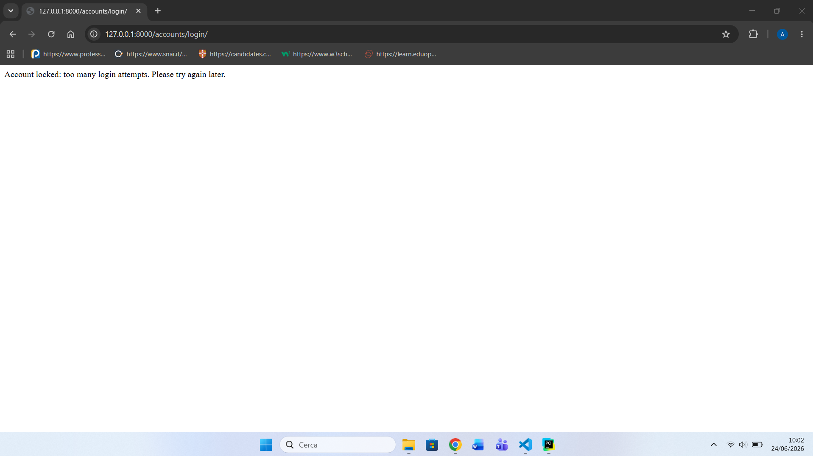
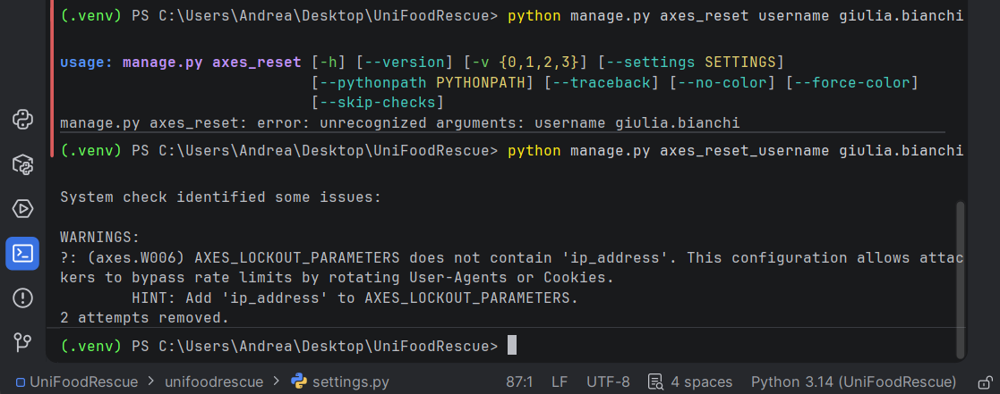

## Attacco Brute force

Si potrebbe aggiungere un limite ai tentativi di login, ad esempio tramite blocco temporaneo dell'account.COME?
TRAMITE pacchetti di tipo `django-axes`.
Esempio:

Dopo 5 tentativi sbagliati, blocco il login per 10 minuti.

In Django si può fare installando il pacchetto:  pip install django-axes

AXES_FAILURE_LIMIT = 5
AXES_COOLOFF_TIME = timedelta(minutes=15)
AXES_LOCKOUT_PARAMETERS = ["username"]

dopo il check, se si ha scelto di basare il blocco solo sull' "username" cioè AXES_LOCKOUT_PARAMETERS = ["username"] allora...

Axes ti avviserà che non starai considerando anche l’indirizzo IP dandoti 0 issues (1 silenced suggested). La documentazione di Axes dice che i tentativi possono essere monitorati per IP, username, user-agent o combinazioni di questi parametri.

Dopo aver raggiunto il limite ci troveremo: 

Possiamo aspettare i 10 minuti o possiamo direttamente resettare secondo l'username bloccato.

Nel nostro esempio era stato fatto con l'utente giulia.bianchi quindi:     python manage.py axes_reset_username giulia.bianchi

Django nuovamente consiglierà vivamente di introdurre come parameters anche l'ip_address per non permettere all'attaccante di bypassare il blocco.

Dunque se tra i parametri di lockout scegliamo di inserire anche indirizzo ip quindi AXES_LOCKOUT_PARAMETERS = ["ip_address","username"]
Allora servirà un reset completo-->                         python manage.py axes_reset

sbloccando così l'indirizzo ip associato alla macchina in cui è stato superato il limite di login, nel nostro caso l'indirizzo localhost di loopback 127.0.0.8
